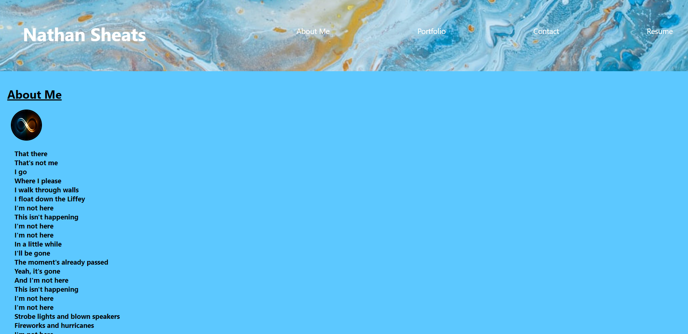
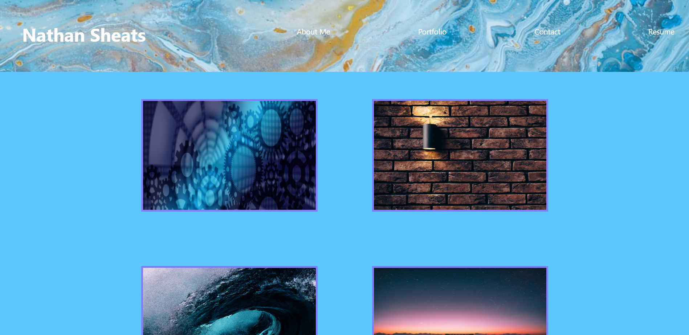
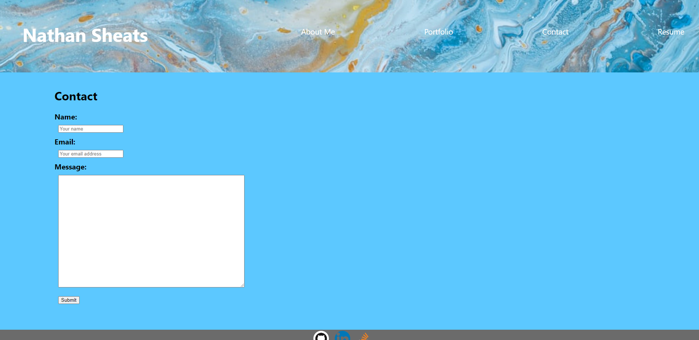
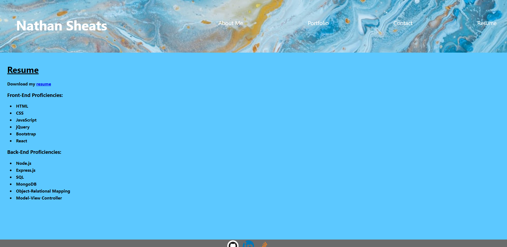

# 20 React: React Portfolio


## Table of Contents

- [Description](#description)
- [User Story](#user-story)
- [Acceptance Criteria](#acceptance-criteria)
- [Mock Up](#mock-up)
- [Installation](#installation)
- [Usage](#usage)
- [License](#license)
- [Contributing](#contributing)
- [Tests](#tests)
- [Questions](#questions)


## Description

A Portfolio created using React. Included are an About Me section complete with an avatar icon, a Portfolio section with a list of projects with links to the associated GitHub repository, a Contact section to submit a name, email address, and a message, and a Resume section with the option to download my resume.

## User Story

```md
AS AN employer looking for candidates with experience building single-page applications
I WANT to view a potential employee's deployed React portfolio of work samples
SO THAT I can assess whether they're a good candidate for an open position
```

## Mock-Up

The following images shows the web application's appearance and functionality:









## Installation

No installation instructions at this time.

## Usage

Run 'npm install' to install then 'npm run start' to access the localhost. 

## License
  
This application is utilizing the following License: None
    
## Questions
  
GitHub Repository Link: https://github.com/Nwsheats/React-Portfolio

Deployed GitHub Pages Link: https://nwsheats.github.io/React-Portfolio/

If you have additional questions, please reach out to me at nwsheats@gmail.com
  
--